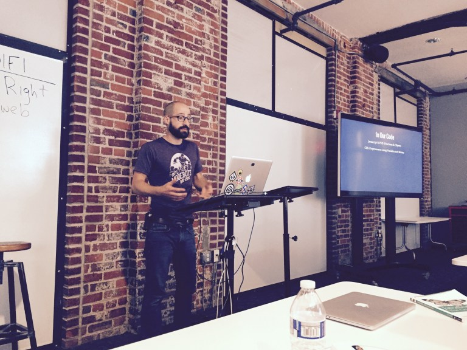

# About Me

Hi. I’m Jon Daiello, a digital craftsman from the Midwest (Go buckeyes!). I focus on being a design leader who helps people create cohesive and polished experiences and then bring them to life with detail oriented, standards-compliant front-end engineering.

# Who I Am

I am 34 years old and have been married to my wonderful wife for 10+ years. We have 3 amazing children, ranging in ages from 1 to 5 years old. I make friends easily and like to build quality relationships, investing in the lives of those around me. My interests and hobbies include teaching and serving in my local church, loving cars, playing guitar, making things and being the family handyman around the ol’ house.

# Career

Even though I’m more than my work, the large portion of my life is dedicated to designing and build the best experiences for users across the web. In my career, strive to do my absolute best and do everything I can to improve myself. Education is paramount in this industry and it’s a part of my regular regiment. I take my work seriously and I work hard to get better and be one of the best. One of my favorite ways to stay connected and grow my abilities is attending local meet-ups in my community. I also host a podcast on digital experiences.

You can [download my resume](/assets/documents/jon-daiello-resume-201611051422.pdf "Jon Daiello's resume") if you are interested.

## Design Manager

TODO

## UX Designer 

TODO

## Front-End Engineer

# Ministry

TODO

## Teacher

TODO

## Counselor

TODO

## Discipler

TODO

## Musician

TODO

# Get In Touch

If you’d like to get in touch with me, feel free to reach out on any of the following social networks:

- Twitter
- Codepen
- LinkedIn
- Dribbble
- The Noun Project